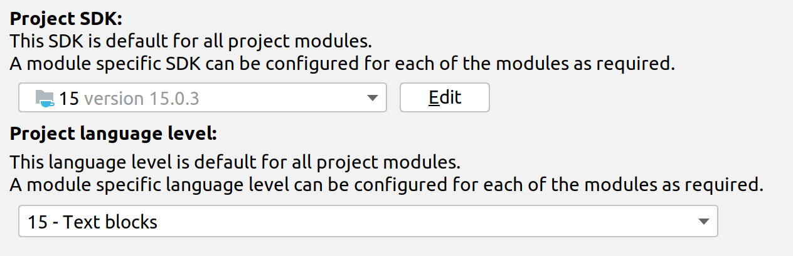

# SeCuGrow - your generated Selenium Cucumber test automation project

If you want to start as fast as possible with [Selenium](https://github.com/SeleniumHQ/selenium) in combination
with [Cucumber](https://github.com/cucumber/cucumber) - here's your place to be. Just clone this repo and start it. It
contains executable minimalistic examples so you can create your own scenarios easily and fast.

You should be familiar with [Kotlin](https://kotlinlang.org/) (or Java) and Cucumber to create new scenarios and
corresponding glue code.

This is a skeleton based on Selenium, Cucumber with Kotlin and parallel-execution support with JUnit 5.
Also, [Cucumber Picocontainers](https://github.com/cucumber/cucumber-jvm/tree/master/picocontainer) were added for a
smooth usage of test data among all steps.
For a quick and easy setup of Webdriver, [WebDriverManager](https://github.com/bonigarcia/webdrivermanager)
from [Boni Garcia](https://github.com/bonigarcia/bonigarcia.github.io) is used.

## Prerequisites

* Java SDK (recommended Version > 17)
* Maven

### Optional

* If you do not want to run the test locally: Selenium Grid, [Selenoid](https://github.com/aerokube/selenoid) or Moon
* For Android or iOS test execution you can use it with [Appium](https://github.com/appium/appium)

# How to run tests locally

* Option 1: Start with Maven

  `mvn clean verify -Dbrowser=chrome -DbaseUrl="https://www.wikipedia.org" -Ddriver.version=101`

* Option 2: Start directly from IDEA with a runConfiguration
  
  Use the runConfiguration File which is located in the resources-folder and adapt the parameter for your need

In both cases you need to define some parameters to get the tests running:

| Name | Description                                                                                                                                   |
|------|-----------------------------------------------------------------------------------------------------------------------------------------------|
| baseUrl* | The base URL for your website under test.                                                                                                     |
| browser | Choose the browser type. Allowed values are defined in DriverTypes Class. default = chrome                                |
| browser.version | If you do not want to use the latest browser version, which is provided by the Webdriver manager, you can set the version with this parameter. |
| selenium.grid | URL of Selenium grid server or a service which implements the Selenium grid protocol like Selenoid or Appium.                                 |
| device.id | only used if you want to run with mit mobile-chrome (Android or iOS id)                                                                       |
| skipA11y | default = true, false -> activates the accessiblity audtis while your testruns (if you created your project with (-Da11y=true)                |

\* is mandatory

### Run tests with Selenium grid, Selenoid or Appium

    -Dselenium.grid=http://<ip-of-your-grid:4444>

Example runtime parameters:

    -Dbrowser=chrome
    -Dbrowser.version=106.0
    -DbaseUrl="http://www.wikipedia.at"

# Scenarios

### Feature file structure

In order to find scenarios faster - especially if they fail - a scenario template with two components is used:

* Filename is given in "[ ]" (squared brackets)
* Description of every scenario starts with [XXX-99 followed again with the [filename]

example:

    Feature: [WIK [wikipedia] Example Feature

      Background:
        Given the start page is loaded

      Scenario: [WIK-01 [wikipedia] 
        Then the searchbar is visible

[wikipedia] means that "wikipedia" is the filename. This makes it much easier to locate steps when IntelliJ Runner or
Jenkins Cucumber report mark a scenario or step as failed.

Scenarios have a unique ID which you have to assign manually and keep track of. If a scenario fails, you can easily jump
to the step definitions via text search in your IDE.

//TODO (add here screenshots from jenkins)

#Supported Browser in DriverType enum
Setup will be done via WebDriverManager as mentioned above.

### regular Browsers for local run

Chrome, Firefox, Opera, IE and Edge

### Remote Browsers (via Selenoid, Selenium Grid, ...)

Chrome, Firefox, Opera, Chrome Mobile, Chrome Mobile Emulation, Android

### Mobile Chrome emulation (with user agent manipulation)

Chrome is used with a manipulated user agent, similar to the mobile view in browser developer mode.
The following option is set in the DriverFactory:
`chromeOptions.setExperimentalOption("mobileEmulation", mobileEmulation);`

### Mobile-chrome (via Selenoid)

This only works if you have a Selenoid or Moon environment. For further information take a look
at [Aerokube Website](https://aerokube.com)

Example of a runtime configuration for an emulated Pixel 2 with a desktop Chrome browser:

    -Dbrowser=chrome_mobile_emulation
    -Dbrowser.version=75.0
    -Ddriver.version=75
    -DbaseUrl="http://www.wikipedia.at"
    -Demulated.device="Pixel 2"

### Android device (via Appium)

You can use an emulated device (AVD Manager) or a connected real device, which both have to be supported by Appium.

    boris@xps13:~/Android/Sdk/platform-tools$ ./adb devices
    List of devices attached
    emulator-5554	device

Use parameter to set the ID `-Ddevice.id="emulator-5554"`

Example of runtime configuration for running a test on a emulated Android device on Appium (which runs locally on Port
4723):

        -Dbrowser=appium_android_device
        -DbaseUrl="http://www.wikipedia.at"
        -Dselenium.grid=http://localhost:4723
        -Ddriver.version=2.34
        -Ddevice.id="emulator-5554"

# Troubleshooting

## IDEA Configuration

If the generated project does not compile or cannot be started from IDEA, check the Version of the JDK
Use an JDK Version above 17

* File - Project Structure ...
  
